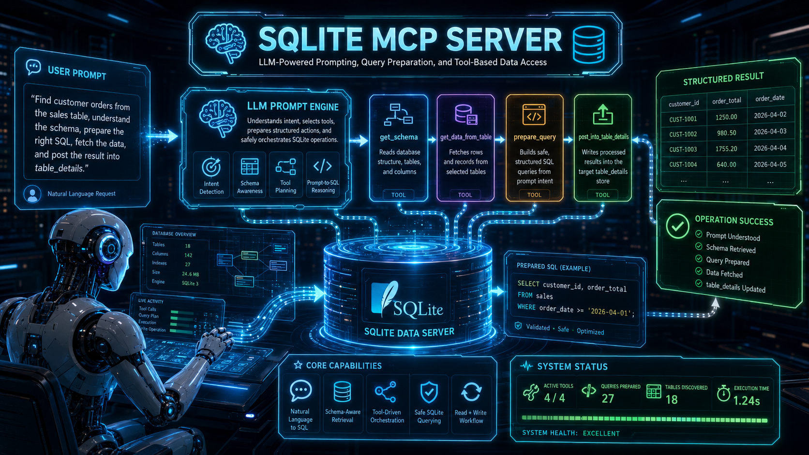

<p align="center">
  
</p>

<h1 align="center">📰 News SQLite MCP Server</h1>

<p align="center">
  <strong>A Model Context Protocol (MCP) server for managing and querying a SQLite database of news articles</strong>
</p>

<p align="center">
  
  
  
  
</p>

---

Built with [FastMCP](https://github.com/jlowcs/fastmcp), this server exposes its capabilities to any MCP-compatible client — including AI orchestrators, agents, and assistants.

## ✨ Features

| Tool | Description |
|------|-------------|
| **`get_schema`** | Retrieve the full schema of the SQLite database (tables, columns, types, constraints) |
| **`get_data_from_table`** | Query rows from the `new_details` table with optional `WHERE`, `ORDER BY`, `LIMIT`, and `OFFSET` support |
| **`prepare_query`** | Convert natural-language questions into SQL queries using an LLM (OpenAI, Groq, or DeepSeek) |
| **`post_into_table_details`** | Insert a new news article record into the database |

## 🗄️ Database Schema

The server manages a single table called `new_details`:

| Column    | Type    | Constraints                         |
|-----------|---------|-------------------------------------|
| `id`      | INTEGER | `PRIMARY KEY`, `AUTOINCREMENT`      |
| `timestamp` | TEXT   | `NOT NULL`                          |
| `source`  | TEXT    | `NOT NULL`                          |
| `news`    | TEXT    | `NOT NULL`                          |
| `header`  | TEXT    | `NOT NULL`                          |
| `keywords`| TEXT    | `NOT NULL`                          |

## 📋 Requirements

- Python **3.10+**
- `pip`

## 🚀 Installation

### 1. Clone & Navigate

```bash
cd mcp_server
```

### 2. Create Virtual Environment

```bash
python -m venv venv
source venv/bin/activate   # On Windows: venv\Scripts\activate
```

### 3. Install Dependencies

```bash
pip install -r requirements.txt
```

### 4. Configure Environment Variables

```bash
cp .env.example .env
```

Edit `.env` to set your preferred LLM provider credentials:

```ini
# LLM Provider
LLM_PROVIDER=openai

# At least one of these API keys:
OPENAI_API_KEY=sk-...
DEEPSEEK_API_KEY=...
GROQ_API_KEY=...

# Toggle providers on/off
USE_OPENAI=true
USE_DEEPSEEK=false
USE_GROQ=false

# Optional: model overrides
OPENAI_MODEL=gpt-4o-mini
GROQ_MODEL=llama3-8b-8192
```

## 🎯 Usage

### Running the Server

Start the server with stdio transport (default for MCP):

```bash
python server.py
```

Alternatively, run it directly via the FastMCP CLI:

```bash
fastmcp run server.py
```

### 🛠️ MCP Tools

Once the server is running, any MCP client can discover and invoke the following tools:

---

#### 1. `get_schema`

Returns the full database schema as a human-readable string.

```json
{
  "name": "get_schema",
  "arguments": {}
}
```

---

#### 2. `get_data_from_table`

Query data from the `new_details` table.

| Parameter      | Type   | Required | Default    | Description                                      |
|----------------|--------|----------|------------|--------------------------------------------------|
| `where_clause` | string | No       | `null`     | SQL WHERE clause (e.g., `source = 'Times of India'`) |
| `limit`        | int    | No       | `50`       | Max rows to return (max 500)                     |
| `offset`       | int    | No       | `0`        | Row offset for pagination                        |
| `order_by`     | string | No       | `id DESC`  | ORDER BY clause                                  |

---

#### 3. `prepare_query`

Convert a plain-English question into a SQLite query using the configured LLM.

| Parameter       | Type   | Required | Description                          |
|-----------------|--------|----------|--------------------------------------|
| `user_question` | string | Yes      | Natural-language question for the DB |

---

#### 4. `post_into_table_details`

Insert a new news article.

| Parameter   | Type   | Required | Description                                    |
|-------------|--------|----------|------------------------------------------------|
| `source`    | string | Yes      | News source name (e.g., "BBC", "Times of India") |
| `news`      | string | Yes      | Article content or summary                     |
| `header`    | string | Yes      | Article headline/title                         |
| `keywords`  | string | Yes      | Comma-separated keywords                       |
| `timestamp` | string | No       | ISO-format timestamp (defaults to current UTC) |

## 🔗 Integration with MCP Clients

### Via `.continue/config.json` (Continue.dev)

```json
{
  "mcpServers": {
    "news-sqlite-server": {
      "command": "python",
      "args": ["/absolute/path/to/mcp_server/server.py"]
    }
  }
}
```

### Via `claude_desktop_config.json` (Claude Desktop)

```json
{
  "mcpServers": {
    "news-sqlite-server": {
      "command": "python",
      "args": ["/absolute/path/to/mcp_server/server.py"]
    }
  }
}
```

## 📁 Project Structure

```
mcp_server/
├── data/               # SQLite database directory (auto-created)
├── venv/               # Virtual environment
├── .env                # Environment variables (not committed)
├── .env.example        # Example environment config
├── instructions.md     # Original design instructions
├── requirements.txt    # Python dependencies
├── server.py           # MCP server implementation
├── image/
│   └── Coverimage.png  # Cover image
└── README.md           # This file
```

## 📦 Dependencies

- **[FastMCP](https://github.com/jlowcs/fastmcp)** – Framework for building MCP servers.
- **[OpenAI Python SDK](https://pypi.org/project/openai/)** – LLM integration (also used for Groq and DeepSeek via compatible endpoints).
- **[python-dotenv](https://pypi.org/project/python-dotenv/)** – Environment variable management.
- **[httpx](https://www.python-httpx.org/)** – HTTP client for LLM API calls.

## 📄 License

This project is part of a larger research backend. See the root project for license details.
